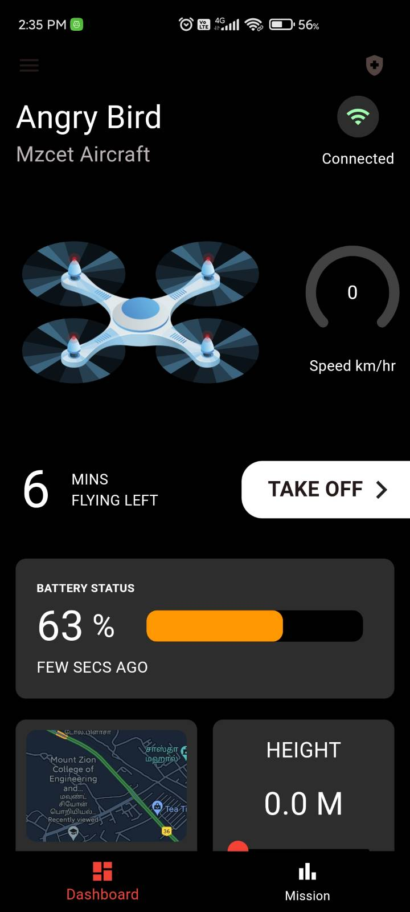
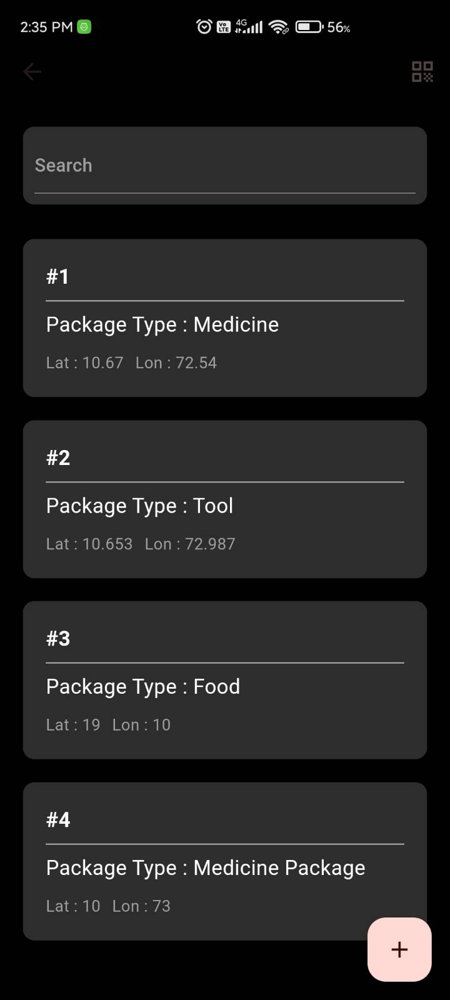
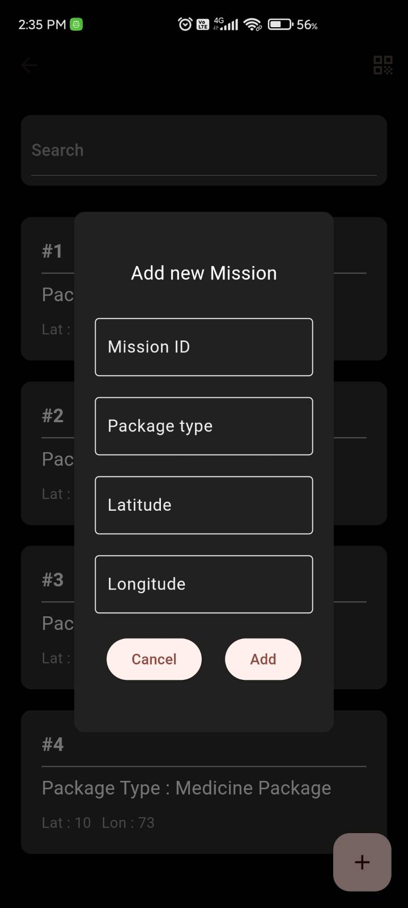
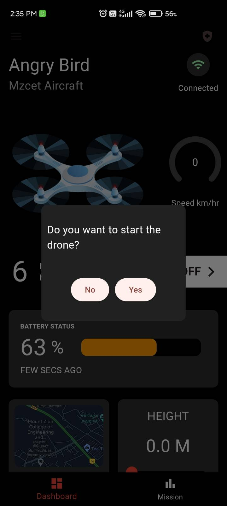

# Rescue Wing - Disaster Recovery Drone Controller

&#x20;

> **Empowering disaster relief workers with drone technology to deliver essential supplies during emergencies.**


  


---

## 📌 Overview

**Rescue Wing** is a **Flutter** application designed to control a disaster recovery drone, ensuring swift and efficient delivery of food, medicine, and other emergency supplies. The app is part of a larger system that includes a drone powered by **Raspberry Pi**, with real-time data exchange via **Firebase**.

---

## ✨ Features

✅ **Mission Management** – Create new delivery missions with specific target locations and package types.\
✅ **Real-time Drone Control** – Take off, adjust altitude and speed, and execute predefined missions.\
✅ **Drone Data Monitoring** – Track drone status, battery level, location, and more in real time.\
✅ **Live Activity Tracking** – Monitor the drone’s journey and mission progress.\
✅ **Two-way Communication** – Utilize Firebase for instant communication between the app and the Raspberry Pi-controlled drone.\
✅ **AI-Powered Assistance** – The drone leverages **machine learning** to detect individuals in need and accurately deliver supplies.

---

## 🎯 Target Audience

This app is designed for **disaster relief workers** who need an efficient and tech-driven approach to deploying drones for emergency supply delivery.

---

## 🛠 Technology Stack

- **Flutter** 🏗️ – Cross-platform mobile application framework.
- **Firebase** 🔥 – Real-time communication and cloud storage.
- **Location Package** 📍 – Enables the drone to navigate and return to the user's location.

---

## 🚀 Getting Started

### 📥 Installation

1. Ensure **Flutter** is installed on your development machine.
2. Clone this repository:
   ```sh
   git clone https://github.com/sens-sens/Rescue-Wing-Flutter.git
   ```
3. Navigate to the project directory:
   ```sh
   cd Rescue-Wing-Flutter
   ```
4. Install dependencies:
   ```sh
   flutter pub get
   ```
5. Connect a physical Android device or start an emulator.
6. Run the app:
   ```sh
   flutter run
   ```

⚠️ **Note:** This project requires a **specific Firebase setup** and is primarily for demonstration purposes.

---

## 📌 Usage Guide

### 🔹 Dashboard

- View real-time drone data (battery level, altitude, speed, GPS location).
- Control drone takeoff, altitude, and mission execution.

### 🔹 Missions

- Create new delivery missions by entering the **target location** (latitude & longitude) and **package type**.
- Monitor active missions and drone progress.

---

## 📸 Screenshots

<p align="center">

  
  <!--  -->
  
  

</p>


---

## 📜 License

This project is currently **not licensed**. Please contact the author if you wish to use or distribute the code.

---

## 💬 Contact

For questions or feedback, connect with me on [**LinkedIn**](https://linkedin.com/in/senthil-sens) or drop an issue in the repository! 🚀

